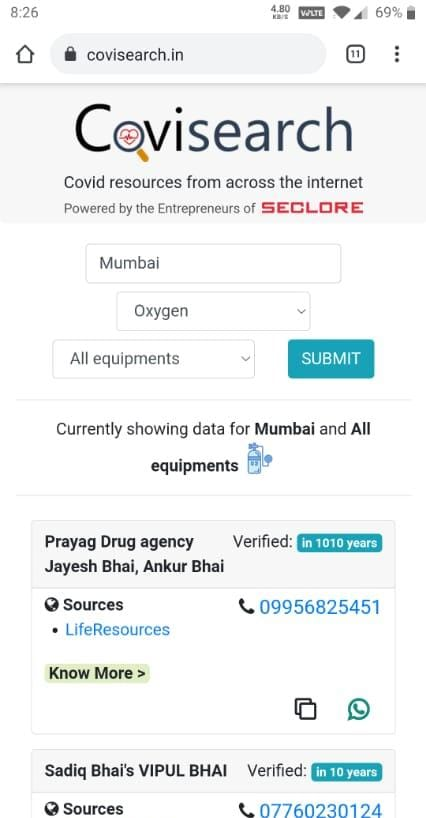
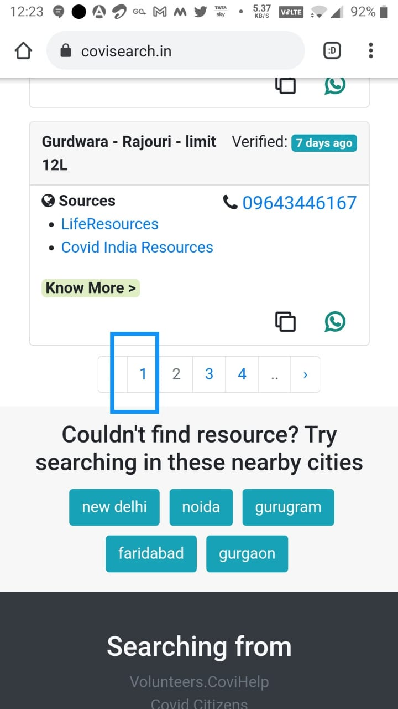
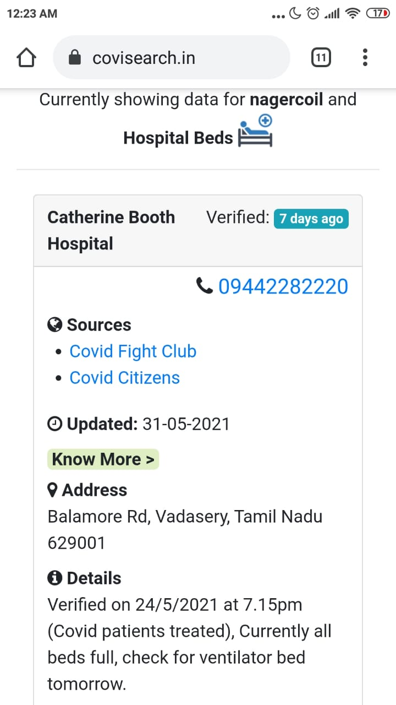
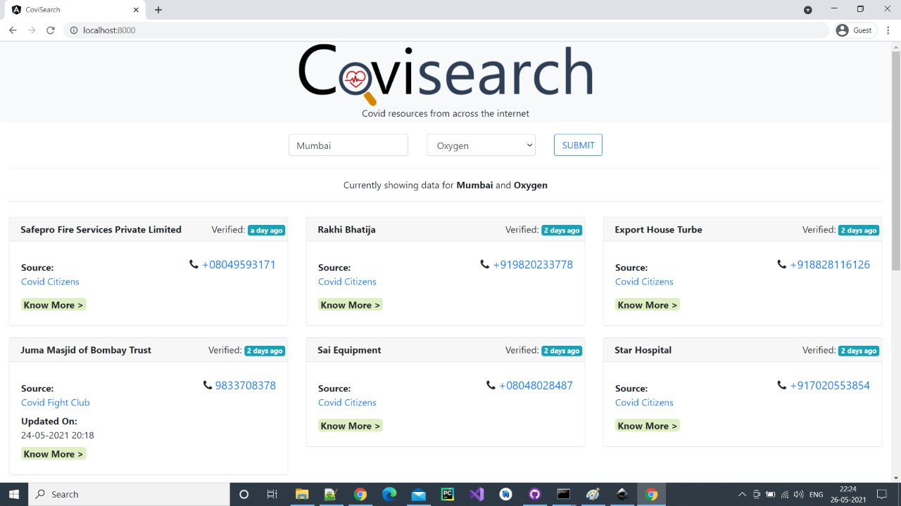

# covisearch
Software system to automatically aggregate verified Covid resources from popular sources. It uses Python backend and basic Javascript for front-end.

This system was deployed on a website https://www.covisearch.in during the Covid second wave which sweeped over India in April-May 2021. The system was used by people and volunteers helping Indians to find critical medical resources to help Covid patients during the dangerous second wave. The wave has subsided, the website has since been taken down. 

This repo contains the code used to make the Covisearch system. Google Cloud Platform was used to deploy the system.

Screenshots:

&emsp;&emsp;&emsp;&emsp;  

Mobile

Desktop

